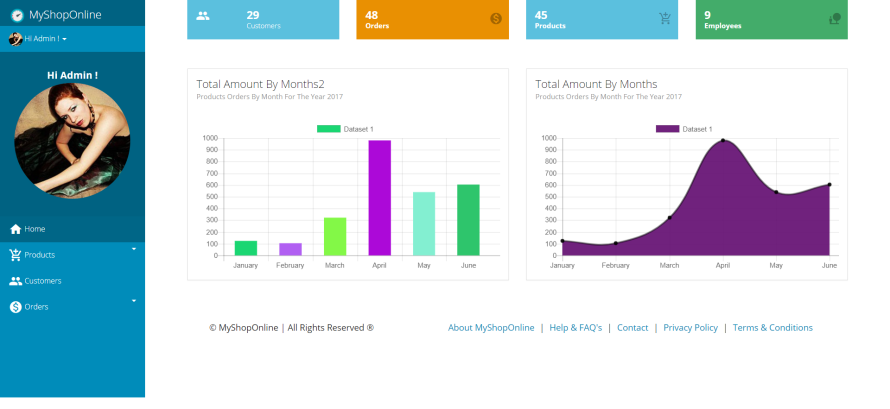

# Welcome to PHPRad Documentations

## Get To Know PHPRad

**PHPRad** framework allows the development and delivery of full web applications with little or no coding experience. It implores a Model View Controller (**MVC**) methodology which ensures the creation of projects that are scale-able and are of industry standard.

**PHPRad** is an advanced rapid application development framework where the model, view and controller components work seamlessly together, although quite independently.

It also allows developers to develop projects connecting to any database of their choice from any source and also gives the option for developers to create new database schema from scratch within the framework.

**PHPRad** provides the creation, configuration, editing of pages and to publish the fully completed application from within its framework within the shortest possible time, effortlessly.

## **PHPRad Amazing Features**

### Drag n' Drop Approach

Designed to allow developer drag and drop components to any page, components dragged to pages can be configured to suite developers functional needs.


### Components And Dashboards

User can include additional components such as record counts, charts, dynamic multi-level menus, sub-pages , etc ... into any page.

.png>)

### Form Wizard

Allows user to build different style of form wizard and can submit each form on next or submit all form together at final step, other components can be dragged onto any step.


### Securities

Security issues such as : SQL Injection, CSRF, XSS, ... etc. have been taken care of.

User Registration And User Account Management (Profile Update, Email Change, Password Reset)


### Application Menu Styles&#x20;

Offers different application menu styles and positions for user to choose from.




### Auto Generated Report Page

&#x20;Can automatically generate report page with various export options like PDF, IMAGE, WORD, EXCEL e.t.c


### Mobile Responsive Application

Applications generated by PHPRad are automatically scalable and mobile responsive&#x20;


### Creating Data Table

This IDE tool helps user create advanced and simple data tables, with record sorting and different pagination option

Can create record action buttons (edit, delete, update) with different display style

Can perform some CRUD Operation in a modal or a page


### Custom Grid Page

User can create and edit the custom grid components to suit her appearance / functional needs.


Can also edit grid pages with our advance code editor with different themes (Lite Version of **SUBLIME TEXT EDITOR**).


### Advance Query Builder

Advanced query builder with SQL code editor.


### RBAC Business Logic Model&#x20;

Implement RBAC business logic model into your application

.png>)

### Modern Bootstrap Templates

Over **60** bootstrap modern template designs available for your project theme


### &#x20;**Material Design Icons**

Select from over **2000** material design icons which can be used on any page


### Components Designers

Intuitive component designers with help description ans hints

Numerous flexible options that helps you build application that best suit your specifications.

.png>)


### Clean And Simple Code

Well structured and professionally Commented Code..

Uses Simple and Powerful **MVC** Framework


### MVC Pattern

Developed using **MVC** (_Model View Controller_) Design Approach

Ensures separation of user actions (_ControllersModels_), and views (_Templates_)

Enforces a clean separation of concerns between the models, views and controllers within an application.


Maintaining a clean separation of concerns makes the developing, maintaining and testing of large complex applications much easier, since the contract between different application components are more clearly defined and articulated.

#### **Suitable for Teamwork**

> #### The way your project is organized in  PHPRad Framework also helps you create a suitable environment for teamwork.
>
> #### You can let your designers work on the Views, database experts on the Models, then the programmer (yourself) build reusable libraries and plugins etc…
>
> #### Also you can let a colleague build unit tests, because PHPRad comes with tools for such projects too.&#x20;
>
> #### **for the developer to edit the source code manually if the needs arise**
>
> #### And most of all, It’s fun!        [Download Setup](https://phprad.com/info/download) here...

[\
](https://phprad.com/info/downloadstarted/vuerad)

```
```

