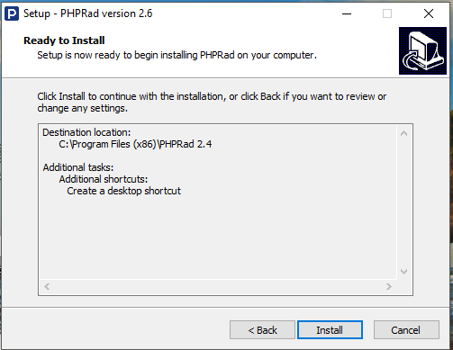

# Installation

## [Download PHPRad Setup Here!](https://phprad.com/info/downloadstarted/vuerad)

At the click of the [**download** ](https://phprad.com/info/downloadstarted/vuerad)button**, PHPRad** will download as a zip file .&#x20;

Go to -> **downloads** -> **open the zip file** -> click the **install** button, you can launch the software at the completion of the installation or close the process and relaunch later.&#x20;


#### The software can be found at **Start** -> **Programs** -> **PHPRad** .



You should make sure you have one of the following localhost servers running on your computer, for example: **Xampp, Wampp, Mampp, Lampp or** any preferable localhost servers



#### Enjoy a 30 day free trial, or buy the full package instantly&#x20;


.png>)

