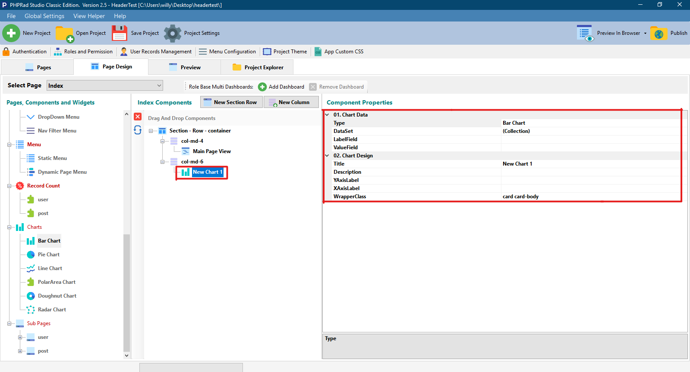

# Chart Component

## 01. Chart Data

### **Type**

Allows user to select the type of data to used in a project

#### **Bar Chart**

A **bar chart** or **bar** graph is a **chart** or graph that presents categorical data with rectangular **bars** with heights or lengths proportional to the values that they represent. The **bars** can be plotted vertically or horizontally. A vertical **bar chart** is sometimes called a line graph. **"Wikipedia"**

#### **Pie Chart**

&#x20;A _pie chart_ (or a circle _chart_) is a circular statistical graphic, which is divided into slices to illustrate numerical proportion. In a _pie chart_, the arc length of each slice (and consequently its central angle and area), is proportional to the quantity it represents. **"Wikipedia"**

#### **Line Chart**

&#x20;A **line chart** or **line** plot or **line** graph is a type of **chart** which displays information as a series of data points called 'markers' connected by straight **line** segments. It is a basic type of **chart** common in many fields.  **"Wikipedia"**

#### **PolarArea Chart**

&#x20;The _Polar Area chart_ is similar to a usual pie _chart_, except sectors are equal angles and differ rather in how far each sector extends from the center of the circle.

#### **Doughnut Chart**

&#x20;The **Doughnut Chart** is a built-in **chart** type in Excel.**Doughnut charts** are meant to express a "part-to-whole" relationship, where all pieces together represent 100%. **Doughnut charts** work best to display data with a small number of categories (2-5). **"Exceljet"**

#### **Radar Chart**

&#x20;A _radar chart_ is a graphical method of displaying multivariate data in the form of a two-dimensional _chart_ of three or more quantitative variables represented on axes starting from the same point. The relative position and angle of the axes is typically uninformative. **"Wikipedia"**

****

### **DataSet**

**Explanation needed!**

#### **Bar Chart**

**Title**

Allows user to name a particular dataset in a chart

**Data Source**

* **Query Builder**
  * **Designer:** Allows user to select tables, fields, sort, sort order, group, aggregate, operand, comparator and value that will be used to build queries
  * **Code:** This is where you view generated queries
  * **Result:** Allows user to observe query results and apply changes in the designer section if needed

**ChartType**

Allows user to select the type of chart to used when displaying data either as **Bar** or **Line**

**BackgroundColor**

* **RandomSIngleColor :** Randomly fills same color for dataset pairs when displaying chart
* **RandomDifferentColor:** Randomly fills different color for dataset pairs when displaying chart
* **NoColor:** Applies no color when displaying chart data
* **ChooseColor:** Allows user select preferred color to fill chart when displaying data

**BorderColor**

* **RandomSIngleColor :** Randomly fills chart border with same color  when displaying dataset&#x20;
* **RandomDifferentColor:** Randomly fills chart border with different color when displaying dataset&#x20;
* **NoColor:** Applies no color when displaying chart data
* **ChooseColor:** Allows user select preferred color to fill chart border when displaying data

**BorderWidth**

Allows user to set the size and thickness of the chart type

#### **Pie Chart**

**Title**

Allows user to name a particular dataset in a chart

**Data Source**

* **Query Builder**
  * **Designer:** Allows user to select tables, fields, sort, sort order, group, aggregate, operand, comparator and value that will be used to build queries
  * **Code:** This is where you view generated queries
  * **Result:** Allows user to observe query results and apply changes in the designer section if needed

**ChartType**

Allows user to select the type of chart to used when displaying data either as **Bar** or **Line**

**BackgroundColor**

* **RandomSIngleColor :** Randomly fills same color for dataset pairs when displaying chart
* **RandomDifferentColor:** Randomly fills different color for dataset pairs when displaying chart
* **NoColor:** Applies no color when displaying chart data
* **ChooseColor:** Allows user select preferred color to fill chart when displaying data

**BorderColor**

* **RandomSIngleColor :** Randomly fills chart border with same color  when displaying dataset&#x20;
* **RandomDifferentColor:** Randomly fills chart border with different color when displaying dataset&#x20;
* **NoColor:** Applies no color when displaying chart data
* **ChooseColor:** Allows user select preferred color to fill chart border when displaying data

**BorderWidth**

Allows user to set the size and thickness of the chart type

#### **Line Chart**

**Title**

Allows user to name a particular dataset in a chart

**Data Source**

* **Query Builder**
  * **Designer:** Allows user to select tables, fields, sort, sort order, group, aggregate, operand, comparator and value that will be used to build queries
  * **Code:** This is where you view generated queries
  * **Result:** Allows user to observe query results and apply changes in the designer section if needed

**ChartType**

Allows user to select the type of chart to used when displaying data either as **Bar** or **Line**

**BackgroundColor**

* **RandomSIngleColor :** Randomly fills same color for dataset pairs when displaying chart
* **RandomDifferentColor:** Randomly fills different color for dataset pairs when displaying chart
* **NoColor:** Applies no color when displaying chart data
* **ChooseColor:** Allows user select preferred color to fill chart when displaying data

**BorderColor**

* **RandomSIngleColor :** Randomly fills chart border with same color  when displaying dataset&#x20;
* **RandomDifferentColor:** Randomly fills chart border with different color when displaying dataset&#x20;
* **NoColor:** Applies no color when displaying chart data
* **ChooseColor:** Allows user select preferred color to fill chart border when displaying data

**BorderWidth**

Allows user to set the size and thickness of the chart type

**PointBackgroundColor**

* **RandomSIngleColor :** Randomly fills same color for dataset point when displaying chart
* **RandomDifferentColor:** Randomly fills different color for dataset point when displaying chart
* **NoColor:** Applies no color when displaying chart data
* **ChooseColor:** Allows user select preferred color to fill dataset point when displaying data

**PointRadius**

Allows user to set the size of the dataset point, the PointRadius is measure in pixels (px)

**PointBorderWidth**

Allows user to set the width for the border **** of the dataset point, the PointRadius is measure in pixels (px)

**PointStyle**

Allows user to set the point radius shape or style for dataset display in a chart

**LineTension**

Allows user to set curve or stretch level in every point on a line&#x20;

**SteppedLine**&#x20;

When set to true makes a headline with the top line flush left and succeeding lines indented to the right

#### **PolarArea Chart**

**Title**

Allows user to name a particular dataset in a chart

**Data Source**

* **Query Builder**
  * **Designer:** Allows user to select tables, fields, sort, sort order, group, aggregate, operand, comparator and value that will be used to build queries
  * **Code:** This is where you view generated queries
  * **Result:** Allows user to observe query results and apply changes in the designer section if needed

**ChartType**

Allows user to select the type of chart to used when displaying data either as **Bar** or **Line**

**BackgroundColor**

* **RandomSIngleColor :** Randomly fills same color for dataset pairs when displaying chart
* **RandomDifferentColor:** Randomly fills different color for dataset pairs when displaying chart
* **NoColor:** Applies no color when displaying chart data
* **ChooseColor:** Allows user select preferred color to fill chart when displaying data

**BorderColor**

* **RandomSIngleColor :** Randomly fills chart border with same color  when displaying dataset&#x20;
* **RandomDifferentColor:** Randomly fills chart border with different color when displaying dataset&#x20;
* **NoColor:** Applies no color when displaying chart data
* **ChooseColor:** Allows user select preferred color to fill chart border when displaying data

**BorderWidth**

Allows user to set the size and thickness of the chart type

#### **Doughnut Chart**

**Title**

Allows user to name a particular dataset in a chart

**Data Source**

* **Query Builder**
  * **Designer:** Allows user to select tables, fields, sort, sort order, group, aggregate, operand, comparator and value that will be used to build queries
  * **Code:** This is where you view generated queries
  * **Result:** Allows user to observe query results and apply changes in the designer section if needed

**ChartType**

Allows user to select the type of chart to used when displaying data either as **Bar** or **Line**

**BackgroundColor**

* **RandomSIngleColor :** Randomly fills same color for dataset pairs when displaying chart
* **RandomDifferentColor:** Randomly fills different color for dataset pairs when displaying chart
* **NoColor:** Applies no color when displaying chart data
* **ChooseColor:** Allows user select preferred color to fill chart when displaying data

**BorderColor**

* **RandomSIngleColor :** Randomly fills chart border with same color  when displaying dataset&#x20;
* **RandomDifferentColor:** Randomly fills chart border with different color when displaying dataset&#x20;
* **NoColor:** Applies no color when displaying chart data
* **ChooseColor:** Allows user select preferred color to fill chart border when displaying data

**BorderWidth**

Allows user to set the size and thickness of the chart type

#### **Radar Chart**

**Title**

Allows user to name a particular dataset in a chart

**Data Source**

* **Query Builder**
  * **Designer:** Allows user to select tables, fields, sort, sort order, group, aggregate, operand, comparator and value that will be used to build queries
  * **Code:** This is where you view generated queries
  * **Result:** Allows user to observe query results and apply changes in the designer section if needed

**ChartType**

Allows user to select the type of chart to used when displaying data either as **Bar** or **Line**

**BackgroundColor**

* **RandomSIngleColor :** Randomly fills same color for dataset pairs when displaying chart
* **RandomDifferentColor:** Randomly fills different color for dataset pairs when displaying chart
* **NoColor:** Applies no color when displaying chart data
* **ChooseColor:** Allows user select preferred color to fill chart when displaying data

**BorderColor**

* **RandomSIngleColor :** Randomly fills chart border with same color  when displaying dataset&#x20;
* **RandomDifferentColor:** Randomly fills chart border with different color when displaying dataset&#x20;
* **NoColor:** Applies no color when displaying chart data
* **ChooseColor:** Allows user select preferred color to fill chart border when displaying data

**BorderWidth**

Allows user to set the size and thickness of the chart type

****

### LabelField

This is the database table containing the item to be displayed as a label on the dataset point in a chart

### ValueField

This is the column in the table containing the values that will be plotted as dataset points in a chart

## 02. Chart Design

### Title

Allows user to name the chart&#x20;

### Description

Enables user to add a description to the chart title

### YAxisLabel

Allows user to name the Y axis of the chart&#x20;

### XAxisLabel

Allows user to name the X axis of the chart&#x20;

### WrapperClass

Allows user to set the class for wrapping the **chart** menu
