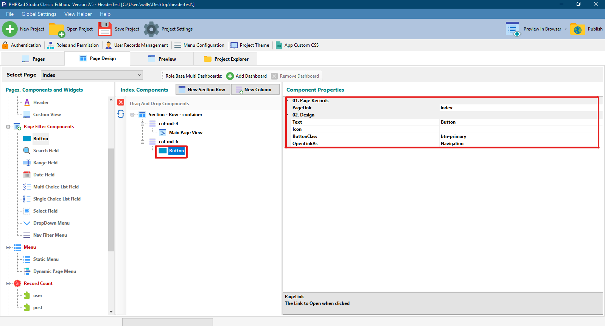

# Button

## 01. Page Records

### PageLink

This is the page that will be navigated to when the current button is clicked. This links the button to a page.

### FilterBy

Allows user to select how to arrange data fetched from the database to be filtered. e.g filter by 'Id'

### FilterValue

Allows user to select the field value to be fetched from the database when linking **`ListPage`** data&#x20;

### OrderBy

Allows user to choose how the data will be queried from the database e.g order 'Id'

### OrderType

Allows user to select how records will be arranged when queried from the database, whether:

* **`DESC`**: Descending
* **`ASC`**: Ascending

## 02. Design

### Text

Allows user to give a name to the button.

### Icon

This is the icon that will be displayed for the button.

### ButtonClass

Here you can use the default  class or add a custom class you have created.

### OpenLinkAs

This is how the button link should be opened.

* **`Navigation`**: Redirects page to the selected **Button** **`PageLink`**
* **`Preloaded Modal`**:  Preloads the page and displays the **Button `PageLink`**on the same page
* **`Ajax Modal`**: Makes request to the **Button's `PageLink`** and displays the **Button `PageLink`**on the same page&#x20;
* **`Ajax Inline`**: Preloads the page and displays the **Button `PageLink`**  in line with **Button `PageLink`** page
