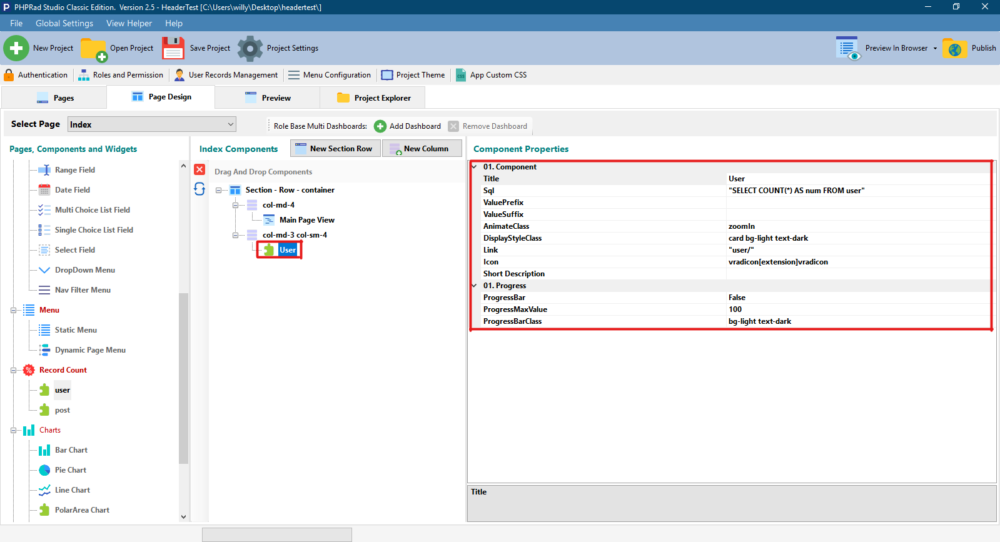
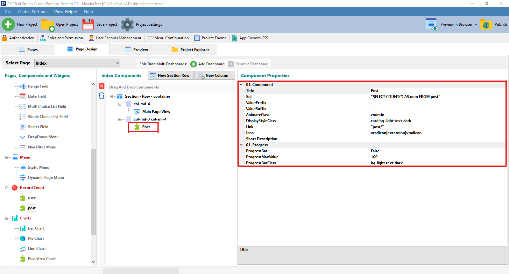

# Record Count Component

## 01. Component

### Title

Allows user to name the **record count**

### Sql

* **Sql Query Editor**
  * **Query Builder**&#x20;
    * **Designer**: Allows user to select tables, fields, sort, sort order, group, aggregate, operand, comparator and value that will be used to build queries&#x20;
    * **Code**: This is where you view generated queries&#x20;
    * **Result**: Allows user to observe query results and apply changes in the designer section if needed
  * **Execute:** When clicked, displays query result of the current Sql statement in the **Sql query editor**
* **Edit Query Params (Separated by commas): Allows user to specify fields to be fetched**

### ValuePrefix

Allows user to set the name or identification value that will be displayed **Before** the **record count** value or result

### ValueSuffix

Allows user to set the name or identification value that will be displayed **After** the **record count** value or result

### AnimateClass

Allows user to select animation style for **record/ data** display

### DisplayStyleClass

Allows user to select design style for **record/ data** display

### Link

This is the link that will be navigated to when the end-user clicks on the record count&#x20;

### Icon

Allows user select an icon for the **Record Count**

### Short Description&#x20;

Allows user to set a brief description of the **Record Count**

## 01. Progress

### ProgressBar

If set to **`True`**, displays a progress bar for **Record Count**

### ProgressMaxValue

Allows user to set the **max value** for the progress bar

### ProgressBarClass

Allows user to set the **custom class** for the progress bar

