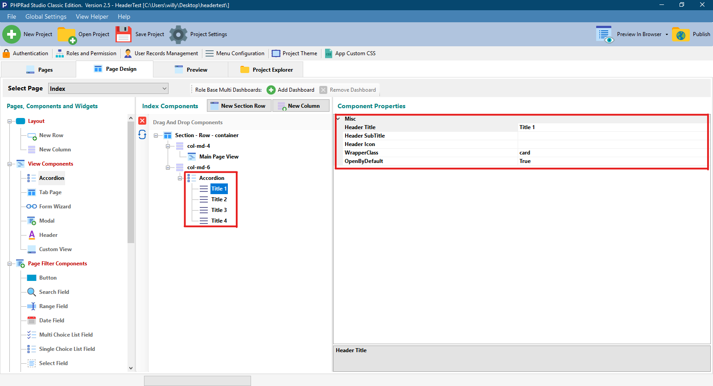

# Accordion

## Misc

### Header Title

Allows user to set the name/ title to a particular **`Accordion`**

### Header Icon

Allows user to set a preferred icon to a particular **`Accordion`**

### WrapperClass

Allows user to set the class for wrapping the **`Accordion`**

### OpenByDefault

When set to **`True`**, displays the content of a particular **`Accordion`** when the page loads

