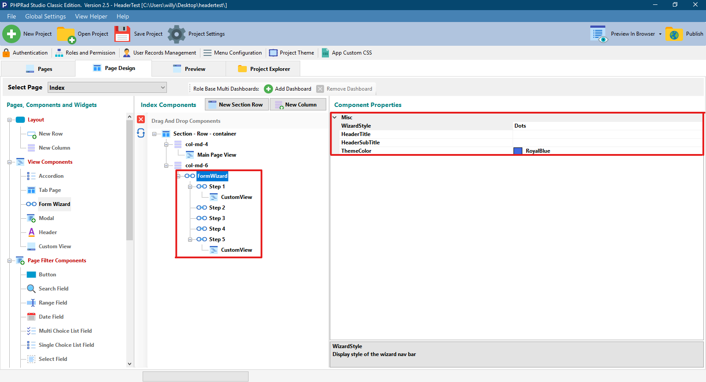

# Form Wizard

## Misc

### WizardStyle

Allows user to set the form wizard style, user can choose **dot**, **circle** or **arrow** as a **`wizardstyle`**

### HeaderTitle

Allows user to set the name/ title to a particular **`Form Wizard`**

### HeaderSubtitle

Allows user to set a subtitle for the **`Form Wizard`**

### ThemeColor

Allows user to set the theme color for a **`Form Wizard`**

