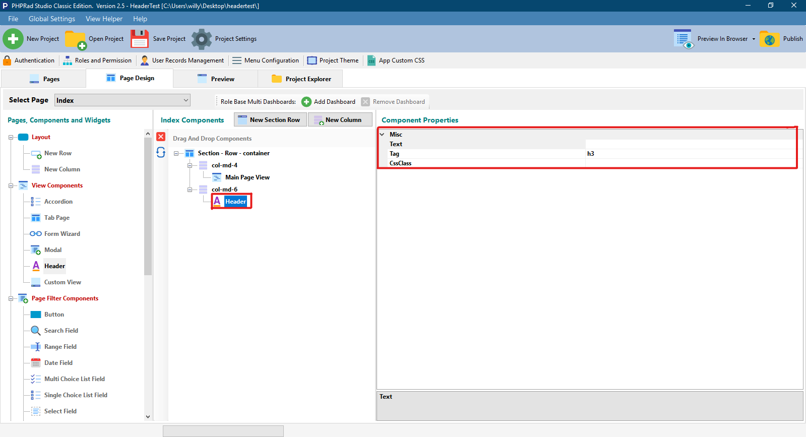

# Header Component

## Misc

### Text

Allows user to set the name / title for the **`Header Component`**

### Tag

Allows user to set the size of the text in the header component , ranges from H1 - H6, where H1 set's the text to the largest size, and H6 set's the text to the lowest size

### CssClass

Allows user to input a custom style or a custom CSS

