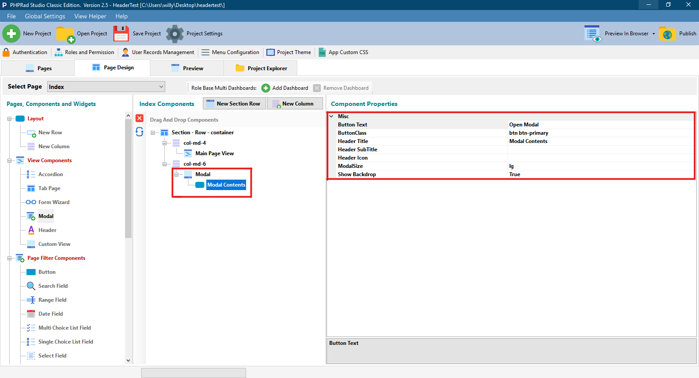

# Modal Component

## Misc

### Button Text

Allows user to name the  **button** that trigger's **** the ** `Modal Component`**

### ButtonClass

Allows user to design the **button** that trigger's the **`Modal Component`**

### Header Title

Allows user to set the name/ title to a particular **`Modal Component`**

### Header SubTitle

Allows user to set a subtitle for the **`Modal Component`**

### Header Icon

Allows user to set a preferred icon to a particular **`Modal Trigger button`**` ``and the`` `**`Modal Component Header`**

### ModalSize

Allows user to set the size of the **`modal component` , where `'lg'` is `Large` and `'sm'` is `Small`**

### Show Backdrop

When set to **`True`**, display's the original page as a backdrop when the modal is open.
