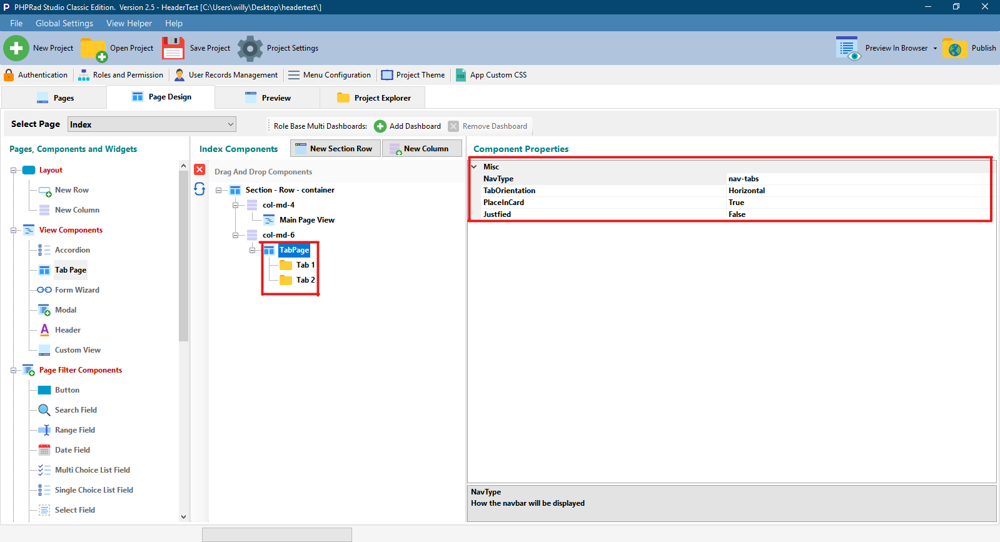

# Tab Page

## Misc

### NavType

Allows user to choose how the Tab in the Navigation Bar would appear, either pill or tab

### TabOrientation

**Horizontal:** When selected arrange's the navigation bar from the left

**Horizontal End:** When selected arrange's the navigation bar from the right

**Vertical:** When selected arrange's the navigation bar from the top

**Vertical End:** When selected arrange's the navigation bar from the bottom

### PlaceInCard

When set to **True,** places the the navigation bar in a card

When set to **False**, displays only the navigation bar

### Justify

When set to **True**, set's the tab to fit in the navigation tab bar

When set to **False**, tabs does not fit in the navigation tab bar
