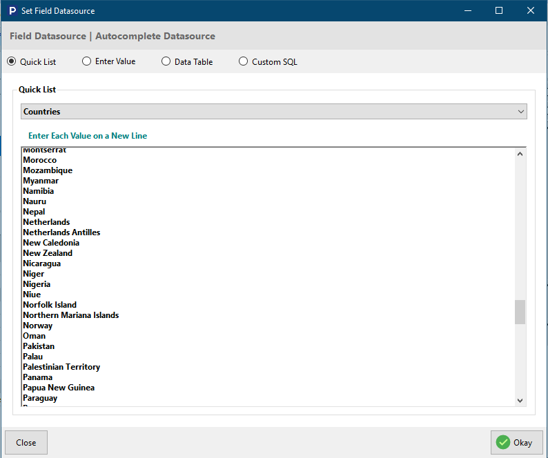

# Add Page Field Properties


**Note**: Anything edited on the **Add Page Field Properties**, reflects on the **Edit Page Field Properties** and vice versa.


## Textbox

### 1. Control Properties

#### Textbox Type

* **Text:** Defines a text entry field in a form.
* **Number:** Defines a number entry field in a form.
* **Email:** Defines an email entry field in a form.
* **Password:** Displays an obfuscated password entry field.
* **Tel:** Defines a telephone entry field in a form.
* **Range:** Defines a range entry field in a form.
* **Date:** Defines a date entry field in a form.
* **Time:** Defines a time entry field in a form.
* **Datetime:** Defines a datetime entry field in a form.
* **Url:** Defines a URL entry field in a form.
* **Hidden:** Makes an input entry field hidden in a form.

#### DefaultValue

Set the default value for current field, if none is supplied by a user.

.png>)

* \--datetime\_now()-- : Defines current date and time as default value.
* \--time\_now()-- : Defines current time as default value
* \--date\_now()--: Defines current date now as default value.
* \--random\_str()-- : Defines a randomly generated string as default value.
* \--random\_num(10)-- : Defines a randomly generated number as default value.
* \--random\_chr(12)-- : Defines a randomly generated character as default value.
* \--random\_color()-- : Defines a randomly generated color as default value.

#### HelpBlock

Set descriptive message about the current field.

#### Disabled

If set to `true`, the field will be disable which only allows for viewing and not modifying.

#### Read\_Only

When set to `true` indicates the field should be read only as the name applies and will not allow for modification.

.png>)

#### Inputicon

Select an icon to be displayed next to the input field.

.png>)

#### StartWithFieldSetTitle

This categorizes inputs into groups or sections.

#### DisplayLabel

This is a text to be displayed next to the input field.

.png>)

#### Placeholder

This the text to display inside the input field while data has not yet been provided.

### 2. Validation

#### Required&#x20;

When set to `true` will not allow the form to be submitted if that field is empty.

.png>)

#### MaxValue

Set the maximum number of characters allowed for users to enter for the current field.&#x20;

.png>)

#### MinValue

Set the minimum number of characters allowed for users to enter for the current field.

#### ValueStep

This defines the difference between points in a range bar. This is used with the TextboxType  `Range`.

#### DecimalPlace

This defines how many decimal places to format a number.

#### RegExp (Regular expression)

This is used to match a particular type of data to a query

.png>)

#### CheckDuplicate

Checks if the same field value already exist in the database table before adding or updating.

### Misc

#### FieldWidth

Sets the width of the current field.

.png>)

#### ClientEvents

This allows user to set event listeners for elements. before you attempt this configuration, you need to have a basic knowledge of JavaScript and [jQuery Events](https://api.jquery.com/category/events/).

**Events**

Double click on any **Event** to get a code snippet of the event on the editor.

**OnChange:** This is used to handle data change on `<select>` element. Use this, when the **Fields Properties** is set to **Select**.

**OnInput**: This is used to handle input value change on `<input>` or `<textarea>`. Use this, when the **Fields Properties** is set to **Textbox** or **Textarea**.&#x20;

**OnClick:** This is used to handle click event on elements such as `
`, `
`, ``, etc. This can't be used on input elements.

**OnDblClick**: This is used to handle double click event on elements such as `
`, `
`, ``, etc. This can't be used on input elements.

**OnHover:** This is used to handle mouse hover event on any element.

**OnFocus**: This is used to handle focus on any form field. This can be used with all **Fields Properties**, except **None**.

**OnBlur:** This is used to handle when a form field looses focus. This can be used with all **Fields Properties**, except **None**.

**OnKeyPress**: This is used to handle when a key on a keyboard is pressed. This can be used with any of the **Fields Properties**.&#x20;

**OnKeyUp: T**his is used to handle when a user releases a key (on the keyboard). This can be used with any of the **Fields Properties**.&#x20;

## Select

The select field shows a drop down list for user to choose options from, and can be customized to suit user's need. The select field property can be customized as shown below.

### 1. Datasource

#### OptionListDataSource

Allows user to select where to pull data from; from a database, table etc

.png>)

**Quick List**: Allows user select list of preferred data, and add more if necessary&#x20;

**Enter Value**: Allows user to enter the values in a field and select preferred label

**Data Table:** Enables user to select table, its value and label

**Custom SQL:** Allows user to enter their custom query

* Query Builder
  * Designer: Allows user to select tables, fields, sort, sort order, group, aggregate, operand, comparator and value that will be used to build queries
  * Code: This is where you view generated queries
  * Result: Allows user to observe query results and apply changes in the designer section if needed

### 1. Datasource Look Up

The **Datasource** look up is just a shortcut for **OptionListDataSource ->** **Data Table**. Instead of going through the process of opening the window and then clicking on **Data Table** and configuring it, configuration can be done using the **Datasource Look Up**.

#### LookUpTable

This is the database table that contains the data you want to use for your lookup/select field.

#### LookUpFieldValue

This is the database table column that holds the data you want to store when an end-user makes a selection.

#### LookUpFieldLabel

This is the database table that holds the data you want to display to end-users when they make a selection.

#### LookUpOrderBy

This is the database table column you want to order the data by.

#### LookUpOrderType

This is how you want to order the data that will be queried, either in ascending(**ACS**) or descending(**DESC**) order. This works hand in hand with the **LookUpOrderBy** column selected.

#### LookUpDependentField

This is the **Add Page Field** that depends on this select fields to populate itself with data.

#### LookUpDependentMatchField

Here you select the **database table column** that contains the data that will be matched with the field selected in **LookUpDependentField**.

#### UseAjaxSearch

If set to **`True`**, make the select field display data that matches end-user input, which also makes the select field searchable. If set to **`False`**, it disables this feature.

### 2. Control Properties

#### HelpBlock

Allows user to set descriptive message about the current field.

.png>)

#### StartWithFieldSetTitle

This categorizes inputs into groups or sections.

#### Inputicon

Select an icon to be displayed next to the input field.

.png>)

#### DefaultValue

&#x20;Set the default value for current field, if none is supplied by the user.

.png>)

#### Disabled

If set to `true`, the field will be disable which only allows for viewing and not modifying.

.png>)

#### DisplayLabel

This is a text to be displayed next to the input field.

.png>)

#### Placeholder

This the text to display inside the input field while data has not yet been provided.

.png>)

#### **Multiple Select**

Set to true if u want to allow for multiple select

#### **Max Select**&#x20;

Specify the max number of items to select from the list. Use -1 for infinity.

#### **UseCustomSelect**

Allows user to set parameters for making custom search

### 3. Validation

#### Required&#x20;

When set to `true` will not allow the form to be submitted if that field is empty.

#### CheckDuplicate

Checks if the same field value already exist in the database table before adding or updating.

.png>)

### Misc

#### FieldWidth

Sets the width of the current field.

.png>)

## Radio

&#x20;The **radio button**  is a graphical control element that allows the user to choose only one of a predefined set of mutually exclusive options. The select field property can be customized as shown below.

### 1. Control Properties

#### OptionListDataSource

Allows user to select where to pull data from; from a database, table etc

.png>)

**Quick List**: Allows user select list of preferred data, and add more if necessary&#x20;

**Enter Value**: Allows user to enter the values in a field and select preferred label

**Data Table:** Enables user to select table, its value and label

**Custom SQL:** Allows user to enter their custom query

* Query Builder
  * Designer: Allows user to select tables, fields, sort, sort order, group, aggregate, operand, comparator and value that will be used to build queries
  * Code: This is where you view generated queries
  * Result: Allows user to observe query results and apply changes in the designer section if needed

#### DisplayAs

This enables users to set how the radio button should appear, as a `Button Group` or `Normal`

#### &#x20;HelpBlock

Allows user to set descriptive message about the current field.

.png>)

#### StartWithFieldSetTitle

This categorizes the Radio button into groups or sections.

#### Disabled

If set to `true`, the field will be disable which only allows for viewing and not modifying.

.png>)

#### DisplayTitle

This is a text to be displayed next to the Radio button, more like a label.

#### DefaultCheckedValue

Set the default checked value for current field, if none is supplied by the user.

### 2. Validation

#### Required

When set to `true` will not allow the form to be submitted if that field is empty.

.png>)

### Misc

#### FieldWidth

Sets the width of the current field.

.png>)

## Checkbox

A checkbox is an Input form field that permits the user to make a binary choice, i.e. a choice between one of two possible mutually exclusive options.

### 1. Control Properties

#### OptionListDataSource

Allows user to select where to pull data from; from a database, table etc

**Quick List**: Allows user select list of preferred data, and add more if necessary

**Enter Value**: Allows user to enter the values in a field and select preferred label

**Data Table:** Enables user to select table, its value and label

**Custom SQL:** Allows user to enter their custom query

* **Query Builder**
  * **Designer:** Allows user to select tables, fields, sort, sort order, group, aggregate, operand, comparator and value that will be used to build queries
  * **Code:** This is where you view generated queries
  * **Result:** Allows user to observe query results and apply changes in the designer section if needed

#### DisplayAs

This enables users to set how the Checkbox should appear, as a `Button Group, Single Switch` or `Normal.`

**Button Group**: This configures the checkboxes as a single group.

**Single Switch**: This configures the checkbox as a single switch, `True` or `False`.

**Normal**: This sets the checkboxes to default.

#### HelpBlock

Set descriptive message about the current field.

.png>)

#### StartWithFieldSetTitle

This categorizes the Checkboxes into groups or sections.

#### DisplayTitle

This is a text to be displayed next to the Checkbox, more like a label.

#### OptionValue

This is the value of the checkbox field. If `OptionListDataSource` is not provided, this would be the value of the checkbox.

#### OptionLabel

This is the label of the checkbox field. If `OptionListDataSource` is not provided, this would be the label of the checkbox.

#### Checked

Allows user to set checkbox default state to be checked.

#### Disabled

If set to `true`, the field will be disable which only allows for viewing and not modifying.

.png>)

### 2. Validation

#### Required

When set to `true` will not allow the form to be submitted if that field is empty.

.png>)

#### MaxSelect

Specify the max number of items to select from the list. Use -1 for infinity.

.png>)

### Misc

#### FieldWidth

Sets the width of the current field.

.png>)

## Textarea

A textarea is an HTML element (tag) used to create a multi-line plain-text editing field.

### 1. Control Properties

#### DefualtValue

&#x20;Set the default value for current field, if none is supplied by the user.

#### Inputicon

Select an icon to be displayed next to the input field.

#### StartWithFieldSetTitle

This categorizes the Textarea into groups or sections.

#### HelpBlock

Set descriptive message about the current field.

.png>)

#### Read\_Only

When set to `true` indicates the field should be read only as the name applies and will not allow for modification.

#### Disabled

If set to `true`, the field will be disable which only allows for viewing and not modifying.

.png>)

#### UseHtmlEditor

When set to `True`, it adds a HTML editor to the Textarea.

#### DisplayLabel

This is a text to be displayed next to the Textarea.

#### Placeholder

This the text to display inside the input field while data has not yet been provided.

.png>)

### 2. Validation

#### Required

When set to `true` will not allow the form to be submitted if that field is empty.

.png>)

#### MinLength

Set the minimum number of characters allowed for users to enter into the current field.

#### MaxLength

Set the maximum number of characters allowed for users to enter into the current field.

#### RegExp (Regular expression)

This is used to match a particular type of data to a query.

#### CheckDuplicate

This checks if the data entered into the textarea already exist in the database.

.png>)

### Misc

#### FieldWidth

Sets the width of the current field.

#### NumRows

Allow user to set the number of column the current field takes.

## File

&#x20;This define an `input` element for file uploads.

### 1. Control Properties

#### DisplayLabel

This is a text to be displayed next to the File input field.

.png>)

#### Disabled

If set to `true`, the field will be disable which only allows for viewing and not modifying.

.png>)

#### HelpBlock

Set descriptive message about the current field.

.png>)

#### StartWithFieldSetTitle

This categorizes the File Input field into groups or sections.

#### Multiple

If set to `True` allows for multiple file uploads and if set to `False` allows for single file upload.

#### Enable DragAndDrop

If set to `True` makes it possible for users to Drag And Drop files on the file input field and if set to `False` disables this feature.

#### DragAndDropMsg

This is the message that appears on the file input field e.g "_Drop files here to upload" ._

#### ControlClass

This is where you add your custom class for the file input, if you created one.

#### UploadDirectory

This is the directory where the file will be uploaded to.

#### FileNameFormat

This is the format the file name will be generated or stored as. If `RandomString` is selected, a random string will be generated and stored as the file name; If `TimeStamp` is selected, the current time will be stored as the file name; If `Date` is selected, the current date will be stored as the file name; If `DirectoryFileSequence` is selected, the files will be stored with a Sequential directory name; If `OriginalFilename` is selected, the original file name will be used.

#### ReturnFullPath

If sets to `True`, returns the full path to the uploaded file.

#### FileNamePrefix

This is the name you want to be constant in all files uploaded through the current file input field. it is always added to the front of the `FileNameFormat` string, example would look like `[FileNamePrefix] + [FileNameFormat]`

``

### 2. Validation

#### AllowedFileExtentions

These are the types of files you want to restrict users to upload. You can select the `*` if you want users to upload any kind of file.


**NOTE**: The `*` is dangerous, only use it if you know what you are doing. Defining each file extension you want to accept on the current file input field is the best way.


#### MaxNumberOfFiles

If you set **`Multiple`** to `True`, this is where you set the maximum number of files that can be uploaded.

#### Max File Size In MB

Use this field to limit the maximum file size in Megabytes.

### Misc

#### Required

When set to `true` will not allow the form to be submitted if that field is empty.

.png>)

## None

When selected, it does not add the current field to the form.

