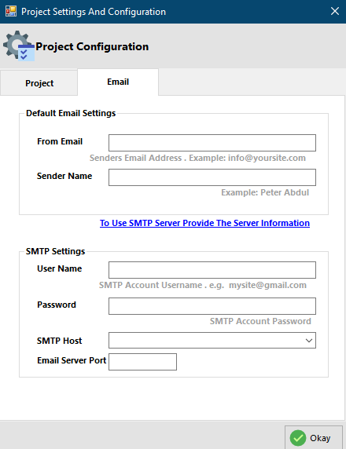

# Email Configuration

## Default Email Settings

### From Email

This is where you set the email address that will be used to send mails to end-users.

### Sender Name

This is the name that will be displayed on the sent email, as the sender of the mail.

## SMTP Settings

Here you enter the email account that will be used to send system emails

### Password

This is the password of the **From Email**.

### SMTP Host

Here you set or select the **SMTP server** of the above email address

### Email Server Port

This is the **SMTP server** communication port.
