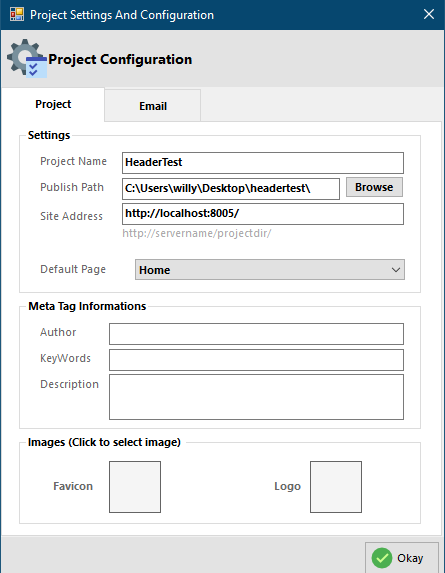

# Project Configuration

## Settings

### Project Name

This is the name you want to give to the project, it will be used in some aspects of the app.

### Publish Path

This is the path/location where you want the generated **PHP** files to be stored on you computer, during the process of development. This is usually at the root of your development server.

### Site Address

This is usually the link to your development server, if left to default PhpRad will start a local server that can be accessed at [http://localhost:8005/](http://localhost:8005/)

### Default Page

This allows you to set the page that you want users to see first when they visit your website. This would be the root page.

## Meta Tag Information

### Author

This allows you to enter a name that will be visible in the meta tag, that will be seen as the name of the Author/Developer of the website.

### Keywords

This is where you place the words that are related to your website and the services you offer, Google uses this to provide better search results to users.

### Description

This is the a brief description of the project, Google uses this to display to user what your site does.

## Images (Click to select image)

### Favicon

You click on the square to add an image that will be display on users browser, to identify you website.

### Logo

You click on the square to add an image that will be display on your site, this usually your company's logo.
